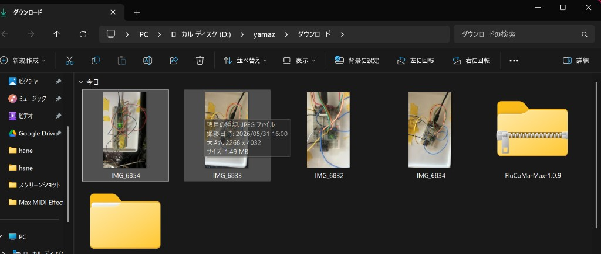
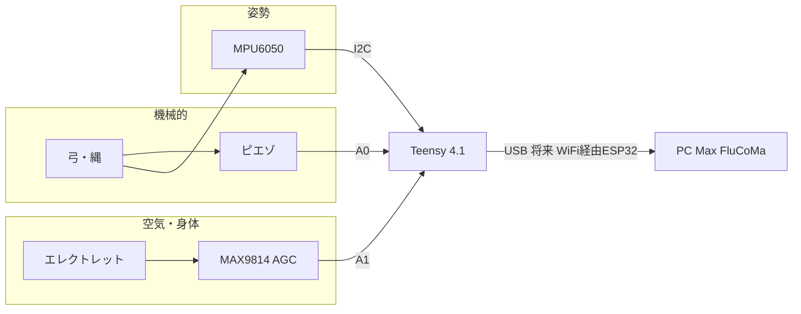

# Teensy 4.1 — ブレッドボード構成 V0（計画）

記録日: **2026-05-31**  
用途: **人間琴 + 弓** — ピエゾ（構造振動）+ MAX4466 + エレクトレット MIC（息・叩き・環境）+ MPU6050（姿勢）

## 写真（実機・2026-05-31）



（元ファイル名: `IMG_6854`）

> **電源・論理はすべて 3.3 V。** Teensy 4.1 のアナログ入力は **5 V 非対応**（3.3 V を超えないこと）。

将来ファーム用のピン定数（予定）:

| 信号 | Teensy pin | Arduino 名 |
|------|------------|------------|
| I2C SDA | **18** | `Wire` デフォルト |
| I2C SCL | **19** | `Wire` デフォルト |
| ピエゾ ADC | **14** | `A0` |
| マイク（MAX4466 OUT） | **15** | `A1` |

---

## 1. 部品リスト

| # | 部品 | 数量 | 備考 |
|---|------|------|------|
| 1 | **Teensy 4.1**（ピンはんだ済み） | 1 | USB で給電・開発 |
| 2 | **MPU6050** ブレイクアウト（GY-521 / HW-123 等） | 1 | I2C 0x68（AD0→GND） |
| 3 | **MAX4466** マイクアンプ（推奨） | 1 | 固定ゲイン・つまみ調整。MAX9814 も可 |
| 4 | **エレクトレットマイク**（カプセル） | 1 | モジュールの MIC+/MIC- へ |
| 5 | **ピエゾ素子** 27 mm 程度 | 1 | 弓・縄の振動用 |
| 6 | 抵抗 **100 kΩ** | 2 | ピエゾ直列 + MAX9814 GAIN 用（後述） |
| 7 | 抵抗 **1 MΩ** | 1 | ピエゾ並列（保護） |
| 8 | コンデンサ **0.1 µF**（104） | 1 | MAX9814 **AR** 用（推奨） |
| 9 | ジャンパ線 | 適宜 | |
| 10 | ブレッドボード + USB micro ケーブル | 1 | |

**任意:** I2C プルアップ **4.7 kΩ** ×2（SDA/SCL→3.3 V）。多くの MPU モジュールは基板に実装済み。

---

## 2. 配線一覧（正本）

### 電源（共通）

| ネット | 接続 |
|--------|------|
| **3.3 V** | Teensy **3.3 V**（ヘッダの 3.3V ピン）→ ブレッドボード **+ レール** → MPU VCC、MAX9814 VDD |
| **GND** | Teensy **GND** → ブレッドボード **− レール** → 全モジュール GND、ピエゾ −、マイク − |

- **VIN / USB** で Teensy に給電（開発時）。周辺は **3.3 V レールのみ**使う（5 V レールに MPU を繋がない）。
- 消費電流の目安: MPU + MAX9814 + ADC は **3.3 V 250 mA 以内**に収まる想定（配線は太め・GND はスター気味に）。

### MPU6050（I2C）

| MPU6050 ピン | Teensy |
|--------------|--------|
| VCC | **3.3 V** |
| GND | **GND** |
| SDA | **18** |
| SCL | **19** |
| AD0 | **GND**（I2C アドレス **0x68**） |
| INT | 未接続（V0） |

### MAX4466 モジュール + マイク（現行）

| MAX4466 ピン | 接続 |
|--------------|------|
| VCC / VDD | **3.3 V** |
| GND | **GND** |
| **OUT** | Teensy **15 (A1)** |
| **MIC+** | エレクトレット **+** |
| **MIC−** | エレクトレット **−** |
| **Gain つまみ** | 実測で調整（時計回り＝必ずアップではない） |

- **AR / GAIN 抵抗は不要**（MAX9814 用。4466 では使わない）
- マイクは **弓・デバイス近く**（息・肌・胴鳴り）。**ピエゾとは物理的に離す**

<details>
<summary>MAX9814 を使う場合（参考）</summary>

| MAX9814 | 接続 |
|---------|------|
| OUT | A1 |
| GAIN | 100k → 3.3V |
| AR | 0.1µF (104) → GND |

</details>

### ピエゾ（アナログ）

```text
ピエゾ + ──[100 kΩ]──┬── Teensy 14 (A0)
                     │
                    [1 MΩ]
                     │
ピエゾ − ─────────────┴── GND
```

| ピエゾ | 接続 |
|--------|------|
| **+** | 100 kΩ 直列 → **A0** |
| **−** | **GND** |
| 並列 1 MΩ | **A0 側**（ピエゾ + ノード）と **GND** の間 |

- **取り付け:** 縄の張力が伝わる点、または弓接触ブロック（XIAO V0 と同じ考え方）。
- 配線は **短く・しっかり固定**（弓の動きでノイズが乗りやすい）。

---

## 3. ブレッドボード配置図（上面）

Teensy 4.1 は **両側の端子がブレッドボード中央の溝に跨る**ように挿す（公式配線と同じ）。

```text
                    [ USB micro ]
                         │
    ═══════════════════════════════════════════  ← Teensy 4.1（上端）
    │  ...  │ 3V3 │ GND │ 14/A0 │ 15/A1 │ 18/SDA │ 19/SCL │ ...  │
    ═══════════════════════════════════════════
              │      │      │       │       │       │
              │      │      │       │       │       └──────────┐
              │      │      │       │       │                  │
    (+) 3.3V ─┴──────┴──────┼───────┼───────┼─── [MPU6050 青板] │
    (−) GND ────────────────┴───────┴───────┴─── VCC GND SDA SCL│
              │              │       │                          │
              │         [100k]│      │                          │
              │              │       │                          │
    [ピエゾ] ─┴─[100k]── A0 ─┘       └── A1 ── [MAX9814 OUT]    │
              [1M]│                      MIC± ─ [エレクトレット]  │
              GND ┘                      VDD GND GAIN AR         │
                                         (GAIN→100k→3V3)       │
                                                                │
    下部レール: GND ════════════════════════════════════════════┘
```

### 推奨レイアウト（手順）

1. ブレッドボード **+ / − レール**に Teensy から **3.3 V / GND** を配る  
2. **MPU6050** を片側に固定（SDA/SCL は **18 / 19** へ最短）  
3. **MAX9814** を反対側（**OUT → A1**、マイク線は離す）  
4. **ピエゾ** は MPU と反対側または端（**A0**、アナログ線はマイク OUT と **束ねない**）  
5. 通電前に **続通・ショート・5V 混入**をテスタで確認  

---

## 4. 信号フロー（演奏意図）



---

## 5. XIAO V0 からの移行対応

| XIAO V0 | Teensy V0 |
|---------|-----------|
| D4 / D5 I2C | **18 / 19** |
| D0 ピエゾ | **14 (A0)** |
| （なし） | **15 (A1)** MAX9814 |
| USB 921600 `DATA` | USB 開発 → 将来 **USB Audio** またはシリアル |

---

## 6. 通電・テスト順

1. **USB** で Teensy を PC に接続（給電 + 書き込み + シリアル）— **問題なし**  
2. Arduino IDE: **Board Teensy 4.1**, **USB Type Serial**  
3. スケッチ: [`firmware/teensy/piezo_mic_adc_test/piezo_mic_adc_test.ino`](../../firmware/teensy/piezo_mic_adc_test/piezo_mic_adc_test.ino)  
4. 書き込み → **シリアルモニタ 115200** → ピエゾ叩き / マイクに話す  
5. 詳細: [`firmware/teensy/README.md`](../../firmware/teensy/README.md)  
6. 次の段階: MPU6050 I2C テスト（未実装）  
7. スピーカー大音量の近くでは **ハウリング**注意 — テストはヘッドホン推奨  

---

## 7. 将来（プロダクト）

| 機能 | 配線予定 |
|------|----------|
| **ESP32 WiFi** | Teensy **Serial1** など（例: TX **1** / RX **0**）UART + 3.3 V + GND |
| **microSD** | 未使用で可（Teensy 4.1 内蔵スロット） |

---

## 8. 注意・安全

- アナログ入力 **3.3 V 上限**（MAX9814 OUT が増幅しすぎないよう GAIN を調整）
- マイク **高ゲイン + スピーカー返し** → Max 側でゲート / フィードバック対策（`DESIGN_LOG.md`）
- ピエゾ **極性**は音の位相に影響（+ を A0 側に統一）

---

## 9. 関連ドキュメント

- 現行 XIAO 実機: [`BREADBOARD_V0.md`](BREADBOARD_V0.md)
- 設計思想: [`../DESIGN_LOG.md`](../DESIGN_LOG.md)
- FluCoMa / M4L: [`../FLUCOMA_SETUP.md`](../FLUCOMA_SETUP.md)
